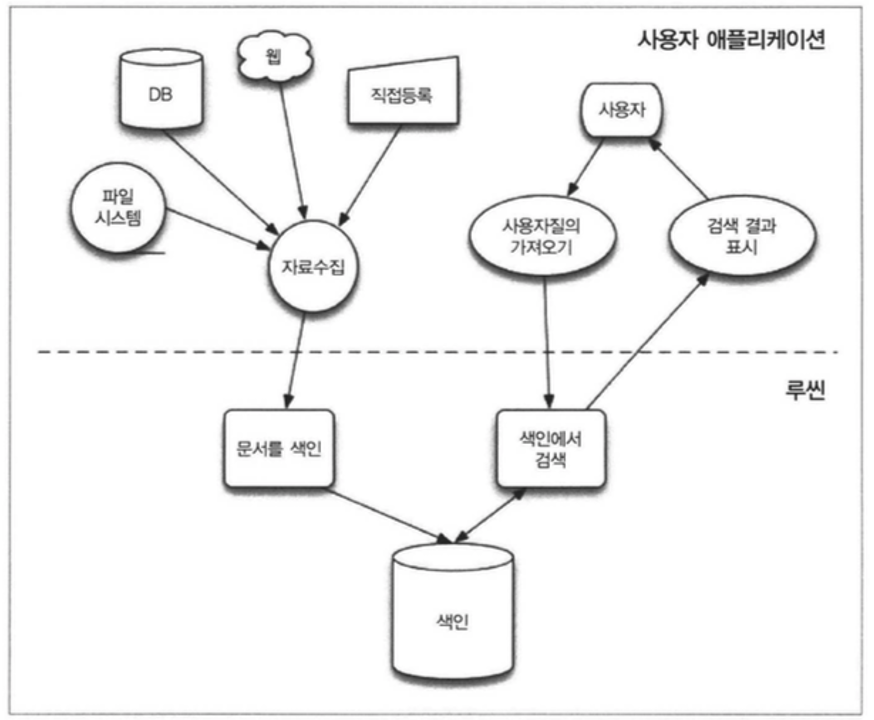

```
Elasticsearch 개략

검색엔진으로 시작했지만, 더이상 검색엔진으로만 사용되지 않고, 분산시스템이라는 목적이 크다.
검색엔진이 비정형 데이터를 검색하는 과정은 크게,
문서 수집 -> 문서 정제 -> 문서 데이터 색인 -> 문서 검색 순으로 이루어진다.
- 문서 수집 : 검색하려는 대상을 수집한다.
- 문서 정제 : 수집된 비정형 문서를 정형 데이터로 정제하고 가공한다.
- 문서 데이터 색인 : 정제된 문서를 빠르게 검색 가능한 구조로 저장한다.
- 문서 검색 : 문서 정보에서 검색어를 찾는다.

Elasticsearch는 Lucene에 인터페이스를 입혀서 런타임, 분산검색, 데이터제공 등을 하므로 Lucene을 깊게 알면 Trouble Shooting하기 좋다. (물론, Lucene에서 사용하는 언어와 Elasticsearch가 상이한 경우도 있다.)

Lucene은 Java로 개발된 고성능 정보검색 오픈소스 라이브러리로, 더그커팅이 개발했다.
Solar역시 Lucene 베이스로 검새할 수 있게 만든 엔진으로, ES, Solar, Lucene Committer가 겹친다. 
이번에 추가된 한국어 형태소 분석기인 Nori도 ES가 아니라 Lucene Core에 추가되었다. 

Lucene Core API 구조는 하기와 같다.
org.apache.lucene.analysis -> 토큰화
org.apache.lucene.codecs
org.apache.lucene.document -> 색인과 검색의 기본단위인 Document를 관리
org.apache.lucene.index -> 색인화
org.apache.lucene.search -> 실제 검색
org.apache.lucene.store
org.apache.lucene.util
```
```
Lucene의 장점
- 적은 메모리 사용으로 대량의 데이터를 효율적으로 처리
- 맞춤형 순위 모델
- 다양한 쿼리 유형 지원
- 정교한 검색지원 
- 필드별 정렬 지원
- 실시간 색인 및 검색 지원! (완전 실시간은 아니지만..)
- 그룹화 및 검색 결과에서 검색 용어 강조 (그룹핑하면 죽어서 ES 에서 aggregation을 만듦)

Lucene 검색의 특징
- 가장 적합한 결과를 상위에 반환하는 순위 검색 지원
- 구문 쿼리, 와일드 카드 쿼리, 근접 쿼리, 범위 쿼리등 풍부하고 강력한 검색어 유형 제공
- 필드 검색 지원(예: 제목, 저자의 필드 등)
- 어떠한 유형의 필드도 정렬 가능
- 다중 인덱스 검색 지원
- 동시 업데이트 및 검색 가능한 준 실시간 검색 제공
- 유연한 그룹핑, 강조 표시, 조인 및 결과 그룹화 지원
- 검색 속도가 빠르고 메모리 효율이 좋을 뿐 아니라 오타를 보정하는 자동완성 기능 제공
- 벡터 공간 모델 및 BM25를 포함한 플러그인 형태의 검색 Scoring 모델 지원


Lucene은 수집과 검색부분을 제공하지 않는다. 색인과 색인에서 검색하는 부분까지만 제공한다.
```


```
색인 : 빠른 검색이 가능하도록 생성된 자료구조
- 원본 문서에서 수집한 텍스트는 Analyzer를 거치면 Term으로 추출된다.
  Lucene은 텍스트 획득기능을 제공하지 않으며, 텍스트 변환의 경우에도 
- Analyzer는 텍스트를 분석가능한 단위로 쪼개고 이를 인덱스에서 효과적으로 인식가능한 용어로 어휘의 원형을 바꾼다.
- 전체 데이터에서 유의미한 용어를 추출하고 정제한 후 저장하는 과정을 일반적으로 Indexing이라고 한다. 그 결과물을 index라고 부른다.

역색인 : Term이 Key가 되는 인덱스 구조
- 페이지 중심의 데이터를 키워드 중심의 데이터구조로 역으로 바꾸는 것이다.
```

```
역색인은 내부적으로 Hash Table이나 Binary Tree 자료구조를 사용해 용어뿐 아니라 문서의 단어 위치같은 메타 데이터까지 가지고 있다. 

사용자가 Search를 할 경우, Lucene은 Analyzer를 사용해 색인과 마찬가지로 질의어를 분석한 후, 그 결과가 모두 포함된 Document를 역색인 구조에서 찾는다.
```
```
검색이란, 필요한 자료를 찾는 일로, 사용자 질의에 적합한 문서를 인덱스에서 찾아내는 것을 말한다.

'춘천에 있는 호수'라고 검색한다면,
1) 루씬은 질의어를 색인과 마찬가지로 텍스트를 분석 -> 춘천, 있, 호수
2) 분석결과에 따라 [춘천, 있, 호수]가 포함된 모든 문서를 역색인 구조에서 찾음
```