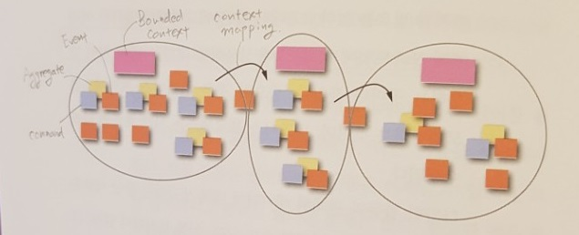
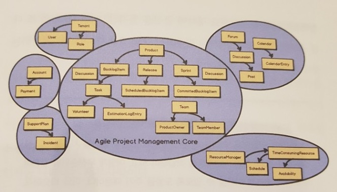

### DDD
---


#### 1장 나에게 도메인 주도 설계는

```
높은 가치를 제공하는 소프트웨어를 설계하고 구현하는 데 있어 전략적, 전술적으로 도움을 주는 도구들의 모음
```
##### 좋은, 나쁜 그리고 효과적인 설계
```
효과적인 설계는 조직이 무엇에 강점을 가져야하는지 이해시키고, 정확한 소프트웨어 모델을 생성하도록 가이드할 때 사용한다.
설계를 고민한다는 것은 그게 어떻게 동작하는지에 대한 것이다.
```
##### 학습 과정과 지식의 정제
```
현상황에 대해 질문을 던지고, 이의를 제기하여 배우고 중요한 지식 획득은 팀 전체로 확산..
```
---

#### 2장 바운디드 컨텍스트 및 보편언어와 전략적 설계
```
DDD는 명확하게 바운디드 컨텍스트 내에서 보편언어를 모델링하는 것에 대한 것
바운디드 컨텍스트 안의 상자들은 모델의 개념을 나타내는데, 이것은 클래스로 구현될 수도 있다. 
기업의 올바른 전략적 결정을 위해 무엇이 핵심도메인이어야 하고, 어떤 것을 제외시켜야 하는지 현명하게 선택해야 한다. 이것이 DDD의 주된 가치 제안이다.
팀의 누군가가 보편언어 표현을 사용하면,팀 모두가 그 표현이 기진 제약사항과 정확한 의미를 이해한다.
하나의 바운디드 컨텍스트를 한 팀이 수행한다. 바운디드 컨텍스트마다 소스코드와 데이터베이스 스키마도 명확히 분리한다. 
공식 인터페이스를 정의해서 바운디드 컨텍스트를 다른 팀이 사용할 수 있게 허용한다. 
```

##### 기본적인 전략적 설계를 하려면
```
바운디드 컨텍스트는 전략적 계획의 핵심이 되는 모든 개념들을 밀접하게 유지하면서 포용해야 하고, 나머지는 모두 제외시켜야 한다. 
기술적 복잡도가 아닌 비즈니스 복잡도에 집중하라
```
##### 보편언어 개발하기
```
핵심 도메인을 명사에만 제한시킬 필요가 없다. 그보다는 핵심도메인이 도메인 모델이 나타난 개념에 대한 구체적인 시나리오들을 나타낼 수 있게 만들어야 한다. 여기서 시나리오는 소프트웨어 프로젝트에서 흔히 말하는 유스케이스나 사용자 스토리같은 것을 의미하진 않는다. 말 그대로 어떻게 도메인 모델이 동작해야하고, 어떤 다양한 컴포넌트들이 동작하는지에 대한 시나리오를 뜻한다.

- 작업에 시나리오 넣기
BDD의 목적은 공유된 이해를 기반으로 보편언어와 모델을 협업을 통해 개발 및 정제하고, 모델이 명세서를 준수하고 있는지를 확인하는 것이다. 인수테스트를 만들어보면서 이를 수행할 수 있다.
```
##### 아키텍처
```
사용자 인터페이스 컨트롤러, Rest Endpoint,나 Message Listener와 같은 Input Adpaters, 유스케이스를 조율하고 트랜잭션을 관리하는 Application Services, Domain Model, Persistence Management, Message Senders와 같은 Output Adapters 
기술은 아키텍처 전반에 걸쳐 산재해 있지만, 도메인 모델은 기술로부터 최대한 자유로워야 한다. 예를 들면, 트랜잭션은 Appication Service에 의해 관리되는 것이지, 도메인 모델에 의해 관리되는 것은 아니다.
```
```
이벤트 주도 아키텍처
CQRS(Command Query Responsibility Segregation)
반응 및 액터 모델
REST
서비스 지향 아키택처(SOA)
MSA
```
---
#### 3장 서브도메인과 전략적 설계
```
애자일 프로젝트 관리 핵심은, 하나의 바운디드 컨텍스트와 하나의 서브도메인 모두를 포함한다는 것이다.
```
##### 서브도메인은 무엇인가?
```
하나의 논리적 도메인 모델 혹은 명확한 전문 지식 영역별로 정의
```
##### 서브도메인의 유형
```
핵심 도메인: 보편언어를 신중하게 만들기 위한 전략적 투자 영역으로, 주요 자원을 할당하는 명시적인 바운디드 컨텍스트이며, 잘 정의된 도메인 모델이 존재한다. 이 도메인은 다른 경쟁자들에 대한 차별화를 만들 영역
지원 서브도메인: 이미 존재하는 제품으로 해결할 수 없는 맞춤 제작 개발이 필요한 모델링 영역
일반 서브도메인: 기존 제품 구매를 통해 바로 충족시킬 수 있는 경우에 해당
```
---
#### 4장 컨텍스트 매핑과 전략적 설계
##### 매핑의 종류
```
파트너십, ​공유커널, 고객-공급자, 준수자, 반부패 계층, 공개 호스트 서비스, 공표된 언어, 각자의 길, 큰 진흙 덩어리
```
##### 컨텍스트 매핑 활용하기
```
​SOAP을 이용한 RPC, 레스트풀 HTTP, 메시징
```
---
#### 5장 애그리게잇과 전술적 설계

##### 왜 필요할까? (엔터티 / 값 객체)

##### 애그리게잇 경험 법칙
```
규칙1: 애그리게잇 경계 내의 비즈니스 불변사항을 보호하라

규칙2: 작은 애그리게잇을 설계하라

규칙3: 오직 식별자로만 다른 애그리게잇을 참고하라

규칙4: 결과적 일관성을 사용해 다른 애그리게잇을 갱신하라
```
##### 애그리게잇 모델링
```
추상화를 조심스럽게 선택하라

올바른 크기의 애그리게잇

테스트 가능한 단위
```
```
단위테스트 만드는 일은 인수테스트에 관한 시나리오 명세 만드는 과정을 따라할 것이다. 여기서 고려해야 하는 것은 애그리게잇이 수행하길 기대하는 대로 정확하게 수행되는지 테스트하는 것이다.
```
---
#### 6장 도메인 이벤트와 전술적 설계
```
비즈니스 도메인은 인과관계가 있는 오퍼레이션이 분산된 시스템의 동일한 요청 내에 존재하는 모든 의존적인 노드들에게 보여지는 경우, 의존관계 일관성을 제공한다. 
전술적 설계 노력을 통해 도메인 이벤트가 도메인 모데에 구체화되고, 도메인 이벤트가 만들어지면 바운디드 컨텍스트와 다른 자원들은 이벤트를 받아 활용한다. 이는 중요한 이벤트에 관심이 잇는 이벤트 리스너들에게 관련 상황의 발생을 알리는 매우 강력한 방법이다. 
```
##### 이벤트 소싱
```
가장 큰 이점 중 하나는 핵심도메인에서 계속 발생하는 모든 기록을 개별적인 발생 수준을 저장한다는 점이다.
```
---
#### 7장 가속화와 관리도구

##### 이벤트 스토밍
```
명사나 데이터보다 비즈니스와 비즈니스 프로세스에 초점을 맞춘다.
UML을 능숙하게 이해하고 사용할 수 있는 비즈니스 측 사람은 거의 없다. UML 대신 포스트잇을 사용. 
모두가 포스트잇과 펜을 갖고 학습 및 설계 세션에 기여할 책임을 갖는다.(모두가 보편언어를 함께 만든다.)
클래스나 데이터베이스가 아닌 이벤트와 비즈니스 프로세스에 집중한다.
매우 시각적인 접근법이다. 코드를 제외시키고 모두를 설계 프로세스의 초반부터 참여하게 한다.
모델에 문제가 있다면 이를 빠르게 인지하고 오해를 바로 잡을 수 있다.
1. 일련의 도메인이벤트를 포스트잇에 적으면서 비즈니스 프로세스를 도출하라. 도메인 이름은 과거형 동사여야 한다. 도메인 이벤트의 결과에서 실행 프로세스를 도출해야 할 경우가 있는데, 핵심 도메인에 중요한 경우에는 구체적으로 모델링해야겠지만, 그렇지 않은 경우 'UserRegisted' 등과 같이 개략적인 이벤트로 모델링하고 넘어가자.(중요한 이벤트에 노력을 집중)
2. 각 도메인 이벤트를 생성하는 명령을 정의하라(정해진 시간, 특정 사용자역할, 명령이 수행될 프로세스)
3. 도메인 이벤트 결과를 생성해내는 명령을 엔터티/애그리게잇에 연관시키자.
```
##### 애자일 프로젝트에서의 DDD 관리
```
​중요한 일부터 먼저

​SWOT 분석 사용

​모델링 스파이크와 모델링 부채

​작업 확인 및 노력 추정
```
##### 기간이 정해진 모델링
```
한 시간 정도의 짧은 이벤트 스토밍 세션을 수행하자
개선해야 할 구체적인 시나리오에 대해 논의하자(실제 도메인 모델 요소(객체)의 목표, 요소들이 어떻게 협업하는지 그리고 사용자들과 어떻게 상호작용하는지에 대한 사항들을 명세해야 한다.)
각 시나리오를 수행할 일련의 인수 테스트를 만든다
컴포넌트에 테스트/명세를 수행 및 정제시키며, 짧고 빠르게 반복한다.
만일 제한 시간이 만료될때까지 원했던 지점에 도달하지 못했다면, 이후에 수행할 수 있도록 모델링 부채(해야할 일)를 명확히 한다.
```