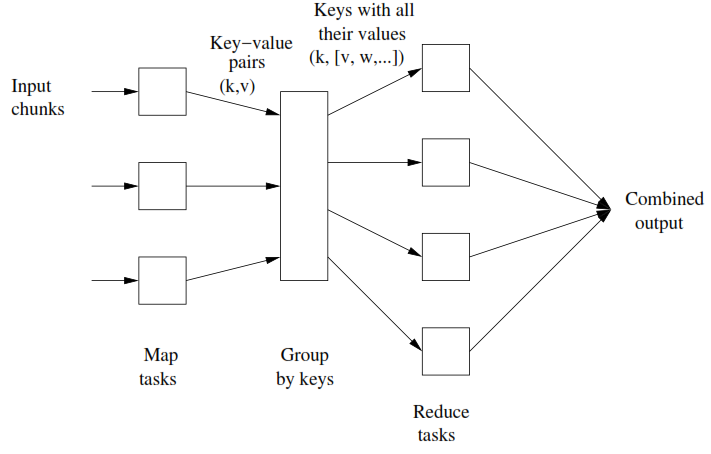

>https://spark.apache.org/docs/latest/rdd-programming-guide.html#which-storage-level-to-choose

## 1주차

#### 질문1. Shared Memory Data Parallelism (SDP)와 Distributed Data Parallelism (DDP)의 공통점과 차이점을 얘기해주세요.
```
SDP란 One compute에서 메모리를 공유해서 처리하는 것으로, 데이터를 일단 쪼갠 뒤, 각 Worker 혹은 Thead가 병렬적으로 처리하고 이를 결합하는 것을 말합니다.
DDP란 데이터를 여러 Node에 나눠 각 Node에서 이를 처리한 후 결합하며, 그러다보니 네트워크 비용이 발생할 수 있어 latency 이슈를 고려해야 합니다.

추가 질문 :  DDP에서도 각각의 SDP 처럼 쓰나요 ?
DDP 안에서 작업이 실행되는 순서를 물어보시는거죠? Spark 설정에 보시면 각 node에 thread 수를 할당해주는 부분도 있기 때문에 map operation의 경우 각 partition 안에서는 SDP 처럼 실행 된다고 보시면 됩니다.
https://stackoverflow.com/questions/46271961/are-spark-executors-multi-threaded
```

#### 질문2. 분산처리 프레임워크 Haddop의 Fault Tolerance는 DDP의 어떤 문제를 해결했나요? 
```
질문이 이해가 잘 안되네요.. Spark는 Data를 in memory에 유지하여 그리고 Immutable(변경하고 싶으면 차라리 새로 만듦으로써) 하기에, Functional transformation을 replaying해줌으로써 Fault tolerance를 확보한 것으로 알고 있습니다.
```

#### 질문3. Spark가 하둡과 달리 데이터를 메모리에 저장하면서 개선한 것 무엇이고, 왜 메모리에 저장하면 그것이 개선이 되나요? 
```
Hadoop은 Iteration할때마다 filesystem에 써야하지만(맵리듀스 잡의 결과를 다른 잡에서 사용하려면 HDFS에 저장해야 하여 반복알고리즘에는 본질적으로 맞지 않습니다), Spark는 여러 데이터 소스에서 읽을 경우 persist(), cache()를 사용합니다. memory는 disk에 비해 100배 빠르므로 속도부분에서 크게 개선하였습니다. 
```

#### 질문4. val ramyons = List("sin", "them", "nugu"); val kkodulRamyons = ramyons.map(ramyon => "koko " + ramyon); 을 사용하여 ramyons 리스트에서 kkodulRamyon List를 새로 만들었습니다. kkodulRamyons랑 똑같이 생긴 List를 만드는 Scala 코드를 써주세요. 
```scala
val kkodulRamyonsList = List("꼬들꼬들 신라면", "꼬들꼬들 틈새라면", "꼬들꼬들 너구리")
```

#### 질문5. val noodles = List(List("sin", "them", "nugu"), List("zza", "whang", "jin")); val flatNoodles = noodles.flatMap(list => list); 을 사용하여 noodles 리스트에서 flatNoodles List를 새로 만들었습니다. flatNoodles랑 똑같이 생긴 List를 만드는 Scala 코드를 써주세요. 
```scala
val flatNoodlesList = List("신라면", "틈새라면", "너구리", "짜파게티", "짜왕", "진짜장")
```

#### 질문6. val jajangs = flatNoodles.filter(noodle => noodle.contains("짜"))를 사용하여 flatNoodles 리스트에서 jajangs List를 새로 만들었습니다.jajangs랑 똑같이 생긴 List를 만드는 Scala 코드를 써주세요. 
```scala
val jajangsList = ("짜파게티", "짜왕", "진짜장")
```

#### 질문7. val jajangMenu = jajangs.reduce((first, second) => first +"," + second); 를 사용하여 jajangs 리스트에서 jajangMenu String을 만들었습니다.jajangMenu랑 똑같이 생긴 String을 만드는 Scala 코드를 써주세요. 
```scala
val jajangMenuList = ("짜파게티,짜왕,진짜장")
```

#### 질문8. Eager execution와 Lazy execution의 차이점은 무엇인가요?
```
Eager execution은 바로 실행되는데 반해, Lazy execution은 Action을 호출하기 전까지는 Transformation의 계산을 실제로 실행하지 않는다. RDD에 Action이 호출되면 Spark는 해당 RDD 계보를 살펴보고, 이를 바탕으로 연산 그래프를 작성하여 Action을 계산한다. 
```

#### 질문9. Transformation과 Action의 결과물 (Return Type)은 어떻게 다를까요? 
```
Transformation는 RDD의 데이터를 조작해 새로운 RDD를 생성하는데 반해, Action은 연산자를 호출한 프로그램으로 계산 결과를 반환하거나 RDD 요소에 특정작업을 수행하려고 실제 계산을 시작하는 역할을 한다.

Action의 경우 결과값이 Unit (Python의 None, C의 void) 인경우도 있고, collection인경우도 있고 진짜 숫자하나인 경우도 있고 다양합니다.

보통 RDD를 중간 처리 결과물을 저장하는데 쓰구요, 최종결과물은 HDFS, DB,  Text파일 등으로 저장합니다.
```

#### 질문10. RDD.cache()는 어떤 작동을 하고, 언제 쓰는 것이 좋은가? 
```
cache 함수를 호출할 경우, 추후 다른 잡을 수행할 때도 RDD가 메모리에 계속 유지되도록 지정할 수 있다. 
따라서 RDD에 API를 사용해 다양한 작업을 실행할 때 유용하다.

추가 질문 : 1 ~ 10 까지 데이타가 있는경우에
전체 노드가 1 ~ 10까지의 RDD를 메모리에 캐시 하는건가요?
아니면 자기가 로드한 데이타의 양만큼만 캐시되는건가요?
각 노드가 로드한 데이타의 양만큼만 캐시됩니다. 노드간 같은 정보공유는 broadcasting이라는 개념이 있는데요 이건 작은 데이터를 공유할때  lookup map같은 유용하게 쓰입니다.

어떤 함수에서 cache()를 했을 때 해당 함수가 종료되면 자동으로 cache()도 해제 되나요?
cache()한 rdd를 unpersist() 연산을 해줘야 메모리에서 해제된다.

그럼 중간에 한 노드가 OOM이 발생하면 다른 노드로 알아서 분산처리되나요? 그러다 혹여 OOM  확산같은게 발생하지는 않나요?
아 네 fault tolerance관련 부분이네요. 이 경우엔 특정한 횟수만큼 원데이터로 부터 여러 transformation을 거쳐 실패한 데이터를 복구 시도하도록 되있습니다. 특정한 횟수를 넘어가는 경우 application이 실패합니다. 
```

#### 질문 11. Lazy Execution이 Eager Execution 보다 더 빠를 수 있는 예를 얘기해주세요. 
```
빈번한 반복 연산이 이루어질 경우 마지막에 메모리에 올려 계산하여 값을 작성함으로써 IO를 줄일수 있다.
조건 검색 혹은 count(10)등의 경우 Full-scan 비용을 줄일 수 있다.
```
```scala
val largeList: List[String] = ...
val wordsRdd =sc.paralleize(largeList)
val lengthsRdd = wordsRdd.map(_.length) -> lazy하기 때문에 아직 아무 작업도 안함
val totalChars = lengthsRdd.reduce() -> 이때 실행이 됨.

http://knight76.tistory.com/entry/%ED%8E%8C-lazy-evaluation%EB%8A%90%EA%B8%8B%ED%95%9C-%EA%B3%84%EC%82%B0%EB%B2%95%EC%97%90-%EB%8C%80%ED%95%9C-%EC%A2%8B%EC%9D%80-%EC%84%A4%EB%AA%85-%EA%B7%B8%EB%A6%BC-%EC%9E%90%EB%A3%8C
```
---

## 2주차

#### 질문 1. foldLeft 와 aggregate 둘다 inputType과 outputType이 다른데 왜 aggregate 만 병렬 처리가 가능한지 설명해주세요. 
```scala
aggregate의 경우 'combop: (B,B)=> B'가 있어 병렬 처리가 가능하다. 
foldLeft를 쓸 경우 예를 들면, 
val xs = List(1, 2, 3, 4)
val res = xs.foldLeft("")((str: String, i: Int) => str + i)
List(1,2) => "12"
List(3,4) => "34"
Scala에서는 Type Casting이 되지만, Spakr에서는 이 다음 작업에서 Type Error가 발생한다.

즉, foldLeft는 시퀀셜하게 처리되기 때문에 병렬처리가 불가능하다. 만약 두개 콜렉션으로 나눠서 병렬처리한다고 했을때, 아웃풋 타입이 바뀌기때문에 두개의 아웃풋을 합치려고 할 때 타입 에러가 나서 더이상 동일한 함수를 적용할수 없다.
반면 aggregate는 seqop과 combop 펑션으로 이루어져있어, chunk로 나눠 처리된 결과를 combop함수를 통해 합칠수 있기 때문에 리턴 타입 변환과 병렬처리가 모두 가능하다.
```
#### 질문 2. pairRDD는 어떤 데이터 구조에 적합한지 설명해주세요. 또 pairRDD는 어떻게 만드나요? 
```
pairRDD는 Key-value 구조로, 데이터를 편리하게 집계, 정렬, 조인할 수 있다.
pairRDD를 만들기 위해서는 여러가지 방법이 있는데 우선, SparkContext의 일부메서드는 Pair RDD를 반환한다. 그리고 자바에서는 JavaSparkContext의 paralleizePairs 메서드에 Tuple2[K,V] 객체로 구성된 리스트를 전달하면 JavaPairRDD 객체를 생성할 수 있다. 또한 mapToPair Transformation 연산자를 통해 생성할 수도 있다. 
```
#### 질문 3. groupByKey()와 mapValues()를 통해 나온 결과를 reduce()를 사용해서도 똑같이 만들 수 있습니다. 그렇지만 reduce를 쓴느 것이 더 효율적인 이유는 무엇일까요? 
```
https://www.linkedin.com/pulse/groupbykey-vs-reducebykey-neeraj-sen/
reduceByKey는 우선 같은 파티션 내에서 진행하지만, groupByKey의 경우 셔플이 선행되므로 네트워크 비용이 크다.

즉, data 가 더 많이 project down 되고, 실제로 셔플이 진행되서 project down 된 데이터를 워커노드가 교환할 경우 네트워크 비용이 그렇지 않을 경우에 비해 현저히 감소하기 때문이다.
https://databricks.gitbooks.io/databricks-spark-knowledge-base/content/best_practices/prefer_reducebykey_over_groupbykey.html
```
#### 질문 4. join 과 leftOuterJoin, rightOuterJoin이 어떻게 다른지 설명하세요. 
```
join은 RDBMS의 inner join과 같다. (두 RDD 중 어느 한쪽에만 있는 키의 요소는 결과 RDD에서 제외)
leftOuterJoin은 두번쨰 RDD에만 있는 요소는 결과 RDD에서 제외된다.
rightOuterJoin leftOuterJoin의 반대이다.
```
#### 질문 5. Shuffling은 무엇인가요? 이것은 distributed data paraellism의 성능에 어떤 영향을 가져오나요? 
```
Suffling이란, 파티션 간의 물리적인 데이터 이동을 의미한다.
이는 새로운 RDD의 파티션을 만들려고 여러 파티션의 데이터를 합칠 떄 발생한다. 가령 Partitioner를 명시적으로 변경하거나(파티션 개수를 변경하거나 사용자 정의 Paritioner를 적용하는 경우), Partitioner를 제거하는 경우에 발생한다.
셔플링을 기점으로 Stage를 나누고 앞 단계를 Shuffle-Map task, 다음 Stage부터 Driver에 반환할때 까지를 Result Task라고 한다. Map Task의 결과를 중간 파일에 기록하며(주로 운영체제의 파일시스템 캐시에만 저장), 이후 Reduce Task가 이 파일을 읽어들인다. 중간 파일을 디스크에 기록하는 작업도 부담이지만, 결국 셔플링할 데이터를 네트워크로 전송해야 하기 때문에 스파크 잡의 셔플링 횟수를 최소한으로 줄이도록 노력해야 한다.
```

```
저기에서 transformation은  map 하고 groupByKey가 있는데, input을 (k,v)형태로 만들어주고, groupBy 가 가능해서, map -> GroupByKey -> reduce 순서대로 진행이 된다.
```
```
map이나 reduce 내부의 함수를 쓸때 외부정보를 빌려오면 간단해지는 경우가 종종 있다.
예를 들어보면 category 에는 카테고리 id 정보가 들어있는데 그 id 들을 카테고리 이름으로 변환해주어야 하는경우.
category.map(id => categoryNameMap.getOrElse(id, ""))
이렇게 쓰게되면 기본적으로 spark에서는 function 자체를 serialize 해서  여러 노드로 분산하기 때문 categoryNameMap 자체가 serialize되서 여러 worker 노드로 여러번 발송되게 된다.
이때 categoryNameMap 용량이 크다면 network overhead가 많이 발생하는데,
이럴 때 categoryNameMap 정보를 각 worker 노드에 미리 공유하여 쓸 수 있도록 한 기능이 Braodcasting 이다.

https://spark.apache.org/docs/latest/rdd-programming-guide.html#broadcast-variables

Broadcast variables allow the programmer to keep a read-only variable cached on each machine rather than shipping a copy of it with tasks. They can be used, for example, to give every node a copy of a large input dataset in an efficient manner. Spark also attempts to distribute broadcast variables using efficient broadcast algorithms to reduce communication cost.

This means that explicitly creating broadcast variables is only useful when tasks across multiple stages need the same data or when caching the data in deserialized form is important.
```
---
#### 질문 1. 셔플링은 무엇이고 언제 발생하나요? 
```
Suffling이란, 파티션 간의 물리적인 데이터 이동을 의미한다.
이는 새로운 RDD의 파티션을 만들려고 여러 파티션의 데이터를 합칠 때 발생한다. 가령 Partitioner를 명시적으로 변경하거나(파티션 개수를 변경하거나 사용자 정의 Paritioner를 적용하는 경우), Partitioner를 제거하는 경우에 발생한다.
```

#### 질문 2. 파티션은 무엇인가요? 파티션의 특징을 2가지 알려주세요. 
```
RDD 데이터의 일부를 의미한다. 스파크는 파일 내용을 여러 파티션으로 분할해 클러스터 노드에 고르게 분산 저장할 수도 있고, 여러 파티션을 노드 하나에 저장할 수도 있다. 
같은 파티션에 있는 tuple(key, value)는 같은 머신에 있어야 한다. 각 노드는 한 개 이상의 파티션을 가지고 있어야 한다. 파티션 개수를 설정할 수 있고 기본적으로는 executor node의 총 코어 개수와 같다.
```

#### 질문 3. 스파크에서 제공하는 partitioning 의 종류 두가지를 각각 설명해주세요. 
```
HashPartitoner는 기본 Partitioner로, pairRDD 키의 hash를 단순한 mod 공식(partitionIndex = hashCode % numberOfPartitions)에 대입해 파티션 번호를 계산한다. 따라서 key의 분배가 균등하지 않을 수 있다. 하지만 대규모 데이터셋을 상대적으로 적은 수의 파티션으로 나눔면 대체로 데이터를 고르게 분산시킬 수 있다. 별도로 매개변수(spark.default.parallelism)를 세팅하지 않으면 클러스터 코어개수를 대신 사용하여 파티션 개수를 지정한다.
RangePartitioner는 정렬된 RDD의 데이터를 거의 같은 범위 간격으로 분할할 수 있다. 대상 RDD에서 샘플링한 데이터를 기반으로 범위 경계를 설정한다. range partitioner를 사용하면 key에 대한 정렬이 되고 key에 대한 정렬된 범위 set을 가지고 있게 된다.
```

#### 질문 4. 파티셔닝은 어떻게 퍼포먼스를 높여주나요? 
```
불필요한 셔플링을 줄여, network 비용을 낮춰(latency가 감소) 성능을 향상시킨다.
```

#### 질문 5. rdd 의 toDebugString 의 결과값은 무엇을 보여주나요? 
```
RDD Lineage Graph를 보여준다. 이를 통해 셔플이 언제 예정되었는지 확인할 수 있다.
```

#### 질문 6. 파티션 된 rdd에 map 을 실행하면 결과물의 파티션은 어떻게 될까요? mapValues의 경우는 어떤가요? 
```
map을 사용할 경우 key가 변경될 수 있지만, mapValues의 경우 key가 보존된다.
```

#### 질문 7. Narrow Dependency 와 Wide Dependency를 설명해주세요. 각 Dependency를 만드는 operation은 무엇이 있을까요? 
```
Narrow Dependency의 경우 parent-child 관계가 1:1로, 셔플이 필요없어서 파이프라인처럼 최적화할 수 있다. (map, mapValues, flatMap, filter, mapPartitions, mapPartitionWithIndex 등의 function이 해당되며 join의 경우에도 co-partitioned input의 경우 해당된다.)
Wide Dependency는 1:다 관계로, 셔플로 인해 모든 데이터를 네트워크에 보내야 하므로 상대적으로 느리다. (groupByKey 등이 해당된다.)
```

#### 질문 8. Lineage 는 어떻게 Fault Tolerance를 가능하게 하나요? 
```
Lineage graph를 그리고 있어, 장애 발생시 체크포인트 파일에 저장해둔 데이터를 읽어들여 장애 발생 이전 스냅샷 지점부터 Lineage를 다시 계산한다.
```
```
 pair-RDD를 쓰지 않을 때는 파티션이 나눠지지 않는건가요 ?
 pairRDD 를 쓰지 않아도 파티션은 나누어져 있습니다. 단, 의도하는 대로 파티션을 나누기 위해서는 pairRDD로 변환해서 key 값을 기준으로 파티션을 나누는게 지금까지 배운 내용입니다 
 키값을 정하지 않으면 임의로 파티션이 나눠진다는 말씀이신것이죠 ?
 네네 맞습니다 그떄는 data 자체가 이미 파티션 되어 있거나, 각 데이터의 hash 값에 의해서 파티션이 나누어 집니다.
 일단 분산처리 시스템에서는 데이터가 기본적으로 여러 파일로 나누어 져 저장 됩니다. 예를 들어서 json파일 10000개를 저장해도 100개씩 10개의 파일에 저장을 하는 구조에요.
 그레서 데이터가 가지고 있는 파티션을 기준으로 기본적으로 파티션이 구성 되구요. 그 이후에는 worker 수에 맞추어 파티션이 구성됩니다.
 (커스터마이징 되지않은 파티션에서는요)

 파티션 개수는 시스템 코어당 몇개로 설정해야 적당할까요? 경험적으로는 파티션 하실 경우에, 각 파티션이 한 100MB 정도 할당되게 하는게 좋은 것 같습니다. 너무 파티션이 많아도 파티션을 추적하는데 overhead가 발생하니까요 (linage) 저는 파일로 저장해보고 확인을 하는 편입니다. UI 에서도 각 worker의 처리량이 파악가능해서 간접적으로 확인이 가능하구요 (https://jaceklaskowski.gitbooks.io/mastering-apache-spark/spark-webui.html)
 
  RDD 연산후의 파티션 개수가 바뀔수도 있을것 같은데 연산 후 기본 파티션개수를 설정할 수 있는 옵션이 있을까요? 파티션 갯수는, 이미 파티션 되어있는 데이터는 변하지 않구요. partitionBy(파티션갯수) 함수를 사용하시면 설정이 가능합니다.
```